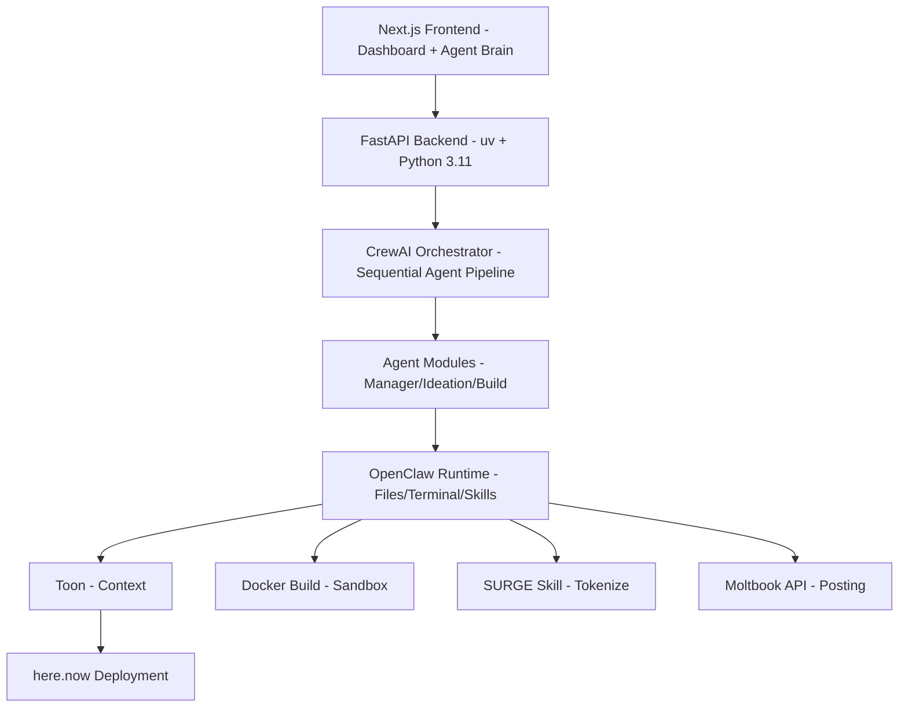

# EIDO – Full Technical Specifications Document

This document defines the complete technical stack, architecture, project structure, API design, workflow, and system relationships for EIDO.

**EIDO** is an autonomous startup factory built for the **SURGE × OpenClaw Hackathon**.

---

## 1. Full Technology Stack

### 1.1 Backend (Core System)

- **Language:** Python 3.11+
- **Package Manager:** uv
- **Web Framework:** FastAPI
- **ASGI Server:** Uvicorn
- **Architecture Pattern:** Modular + Service Layer
- **Agent Orchestration:** CrewAI
- **Agent Runtime Execution:** OpenClaw
- **Token Optimization Layer:** Toon
- **Deployment Integration:** here.now API
- **Tokenization Layer:** SURGE Skill (via OpenClaw)
- **Database:** SQLite (Hackathon Scope)
- **ORM:** SQLModel / SQLAlchemy
- **Validation:** Pydantic
- **Containerization:** Docker
- **Logging:** Structured JSON logging

### 1.2 Frontend

- **Framework:** Next.js (App Router)
- **Language:** TypeScript
- **Styling:** Tailwind CSS
- **UI Components:** shadcn/ui
- **State Management:** React Context (Zustand if needed)
- **API Communication:** Fetch / Axios
- **Architecture Pattern:** Component-based modular structure
- **Deployment:** Vercel or here.now (if unified runtime)

### 1.3 Infrastructure & DevOps

- **Containerization:** Docker
- **Runtime Hosting:** here.now
- **Environment Management:** .env files
- **Version Control:** GitHub (Public Repository)
- **CI (Optional):** GitHub Actions

---

## 2. High-Level System Architecture



The system follows a **microservices architecture** with clear separation of concerns between frontend, backend, agent orchestration, and infrastructure layers.

---

## 3. Project Structure

### 3.1 Backend Project Structure (MVC Architecture)

We follow a clean **MVC + Service Layer** architecture:

- **Models** → Database schemas
- **Controllers** → Request handlers (HTTP layer)
- **Routes** → API route definitions
- **Services** → Business logic layer
- **Repositories** → Data access abstraction
- **Agents** → Autonomous workflow layer

```text
backend/
├── pyproject.toml
├── uv.lock
├── Dockerfile
├── .env
├── app/
│   ├── main.py
│   ├── config.py
│   ├── db.py
│   │
│   ├── api/                       # MVC HTTP Layer
│   │   ├── routes/                # Route definitions
│   │   │   ├── mvp_routes.py
│   │   │   ├── agent_routes.py
│   │   │   ├── token_routes.py
│   │   │   └── deploy_routes.py
│   │   │
│   │   ├── controllers/           # Controllers (Request Handlers)
│   │   │   ├── mvp_controller.py
│   │   │   ├── agent_controller.py
│   │   │   ├── token_controller.py
│   │   │   └── deploy_controller.py
│   │   │
│   │   └── services/              # Business Logic Layer
│   │       ├── mvp_service.py
│   │       ├── agent_service.py
│   │       ├── token_service.py
│   │       └── deploy_service.py
│   │
│   ├── repositories/              # Data Access Layer
│   │   ├── mvp_repository.py
│   │   ├── token_repository.py
│   │   └── agent_run_repository.py
│   │
│   ├── models/                    # Database Models
│   │   ├── mvp.py
│   │   ├── token.py
│   │   └── agent_run.py
│   │
│   ├── agent/                     # Autonomous Agent Layer
│   │   ├── orchestrator.py
│   │   ├── manager_agent.py
│   │   ├── ideation_agent.py
│   │   ├── architecture_agent.py
│   │   ├── builder_agent.py
│   │   ├── devops_agent.py
│   │   ├── business_agent.py
│   │   ├── feedback_agent.py
│   │   ├── reflection_loop.py
│   │   └── context_optimizer.py
│   │
│   ├── deployment/
│   │   ├── docker_builder.py
│   │   └── herenow_client.py
│   │
│   ├── surge/
│   │   └── token_manager.py
│   │
│   ├── moltbook/
│   │   └── publisher.py
│   │
│   ├── memory/
│   │   ├── execution_log.py
│   │   └── state_store.py
│   │
│   └── skills/                    # OpenClaw Skill Definitions
│       ├── manager/
│       │   └── SKILL.md
│       ├── ideation/
│       │   └── SKILL.md
│       ├── architecture/
│       │   └── SKILL.md
│       ├── builder/
│       │   └── SKILL.md
│       ├── devops/
│       │   └── SKILL.md
│       ├── business/
│       │   └── SKILL.md
│       └── feedback/
│           └── SKILL.md
```

### 3.2 Frontend Project Structure

```text
frontend/
├── package.json
├── next.config.js
├── tailwind.config.ts
├── tsconfig.json
├── app/
│   ├── layout.tsx
│   ├── page.tsx                # Dashboard
│   ├── mvp/
│   │   ├── page.tsx            # MVP list
│   │   └── [id]/page.tsx       # MVP detail
│   ├── agent/
│   │   └── page.tsx            # Agent Brain
│   └── globals.css
│
├── components/
│   ├── dashboard/
│   ├── mvp/
│   ├── agent-brain/
│   └── ui/
│
├── lib/
│   ├── api.ts
│   └── types.ts
```

---

## 4. API Endpoints (Backend)

All endpoints follow **REST principles**.

### 4.1 MVP Endpoints

- **POST** `/api/mvp/start` → Trigger full autonomous pipeline
- **GET** `/api/mvp/list` → Retrieve all MVPs
- **GET** `/api/mvp/{id}` → Retrieve single MVP details
- **DELETE** `/api/mvp/{id}` → Delete MVP

### 4.2 Agent Control Endpoints

- **POST** `/api/agent/run` → Manually trigger agent pipeline
- **GET** `/api/agent/status` → Get current pipeline state
- **GET** `/api/agent/logs` → Fetch execution logs

### 4.3 Token Endpoints

- **POST** `/api/token/create` → Create SURGE token for MVP
- **GET** `/api/token/{mvp_id}` → Retrieve token details

### 4.4 Deployment Endpoints

- **POST** `/api/deploy/{mvp_id}` → Deploy MVP
- **GET** `/api/deploy/status/{mvp_id}` → Check deployment status

---

## 5. Backend ↔ Frontend Integration

| Frontend Page | Backend Endpoint | Agent Involved | Purpose |
|---------------|------------------|----------------|---------|
| Dashboard | `GET /api/mvp/list` | ManagerAgent | Show all MVPs |
| MVP Detail | `GET /api/mvp/{id}` | All | Show lifecycle |
| Start Button | `POST /api/mvp/start` | ManagerAgent | Trigger full cycle |
| Logs Panel | `GET /api/agent/logs` | Reflection | Show build logs |
| Token View | `GET /api/token/{mvp_id}` | Business | Display token |
| Deploy View | `GET /api/deploy/status/{mvp_id}` | DevOps | Show deployment |

---

## 6. Agent Workflow (Sequential Pipeline)

The agent system follows a **strict sequential pipeline**:

1. **ManagerAgent** initializes pipeline
2. **IdeationAgent** discovers idea
3. **ArchitectureAgent** generates structured blueprint
4. **BuilderAgent** generates scaffold
5. Docker build executed
6. If fail → Reflection loop triggered
7. If success → **DevOpsAgent** deploys
8. **BusinessAgent** creates token
9. **FeedbackAgent** posts to Moltbook
10. **Manager** updates state

**Execution Rules:**
- Sequential execution only
- Maximum retry count = 3
- Strict stage validation using Pydantic

---

## 7. Agent Skills Structure (.md Files)

Each agent has its own dedicated skill directory following the **OpenClaw Skill specification**.

```text
backend/
└── app/
    └── skills/
        ├── manager/
        │   └── SKILL.md
        ├── ideation/
        │   └── SKILL.md
        ├── architecture/
        │   └── SKILL.md
        ├── builder/
        │   └── SKILL.md
        ├── devops/
        │   └── SKILL.md
        ├── business/
        │   └── SKILL.md
        └── feedback/
            └── SKILL.md
```

Each skill folder **MUST** contain a file named `SKILL.md`. This file defines the agent behavior using:

- YAML frontmatter metadata
- Role definition
- Allowed tools
- Workflow steps
- Strict output schema
- Constraints and retry rules

### 7.1 Standard SKILL.md Template (Detailed)

```markdown
---
name: <AgentName>
description: <Short description of responsibility>
version: 1.0
author: EIDO
---

## Role

Define exactly what this agent is responsible for.
Clearly state what the agent MUST NOT do.

---

## Allowed Tools

Explicitly list allowed OpenClaw tools.
For example:
- browser.search
- browser.open
- file.write
- terminal.run
- surge.create_token
- memory.read
- memory.write

Disallowed tools must also be clearly stated.

---

## Workflow

Step-by-step deterministic execution logic.
1. Receive structured input from previous stage
2. Perform defined operation
3. Validate output
4. Return structured result

No free-form reasoning outside workflow.

---

## Output Format (STRICT)

Return ONLY valid JSON in the following structure:

{
  "field_1": "",
  "field_2": "",
  "field_3": ""
}

No markdown.
No commentary.
No explanation.

---

## Constraints

- Maximum retry attempts
- Context limitations
- Tool usage boundaries
- Length limits
- Safety rules
```

### 7.2 Example – Builder Agent SKILL.md

```markdown
---
name: BuilderAgent
description: Generates deterministic MVP scaffold and fixes build errors.
version: 1.0
author: EIDO
---

## Role

You generate and repair MVP code using predefined templates.
You do NOT design product architecture.
You only execute build instructions from ArchitectureAgent.

---

## Allowed Tools

- file.write
- file.read
- terminal.run
- memory.read
- memory.write

You are NOT allowed to:
- deploy services
- create tokens
- browse internet

---

## Workflow

1. Receive structured blueprint.
2. Generate scaffold files based on approved template.
3. Run Docker build.
4. If build fails:
   - Capture logs
   - Compress logs via Toon
   - Apply deterministic fix
   - Retry (max 3 attempts)
5. Return build status.

---

## Output Format (STRICT)

{
  "build_status": "success | failed",
  "retry_count": 0,
  "log_summary": ""
}

---

## Constraints

- Maximum retries: 3
- Do not modify files outside project root
- Do not introduce new dependencies unless specified
```

---

## 8. Database Schema Overview

### Table: mvp
- `id`
- `name`
- `status`
- `idea_summary`
- `deployment_url`
- `token_id`
- `created_at`

### Table: agent_runs
- `id`
- `stage`
- `status`
- `log`
- `timestamp`

### Table: tokens
- `id`
- `mvp_id`
- `contract_address`
- `created_at`

---

## 9. Build & Deployment Flow

1. **BuilderAgent** writes scaffold
2. Docker container built locally
3. Health check performed
4. Container pushed to here.now
5. Public URL returned
6. Stored in database

---

## 10. Security & Constraints

- Sequential execution only
- Strict Pydantic validation
- Max retry = 3
- Token operations on testnet only
- Context limited via Toon

---

## 11. Execution Principles

- Deterministic templates
- No uncontrolled LLM output
- Strict stage validation
- Clean separation of responsibilities
- Stable demo priority over complexity

---

**End of Full Technical Specifications Document**

